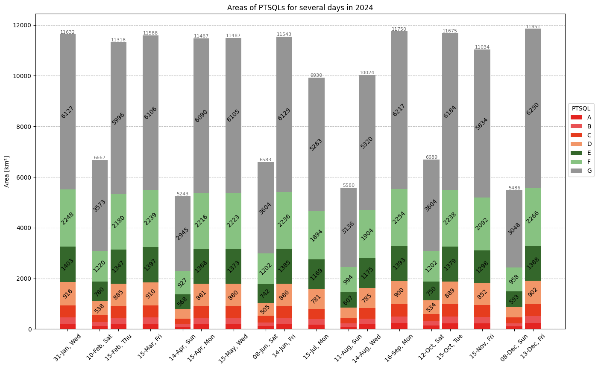
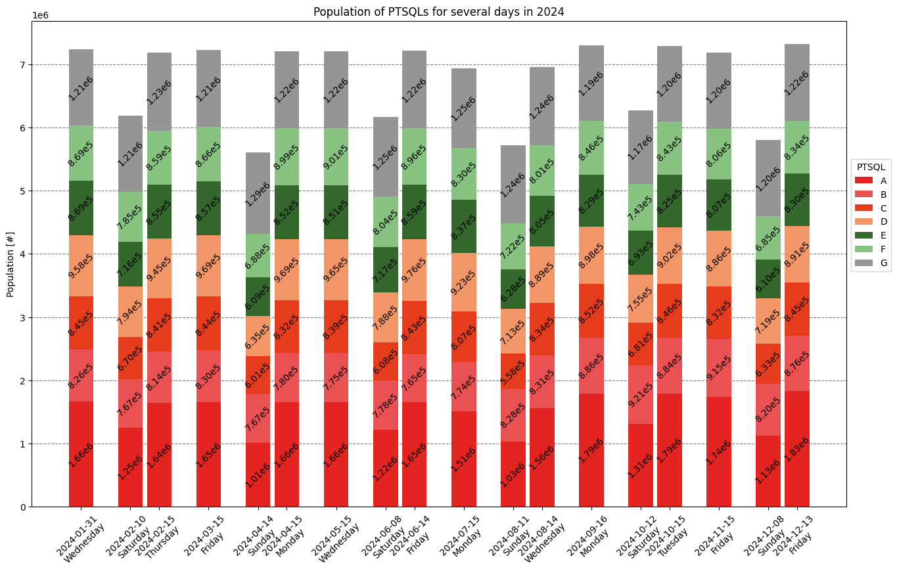
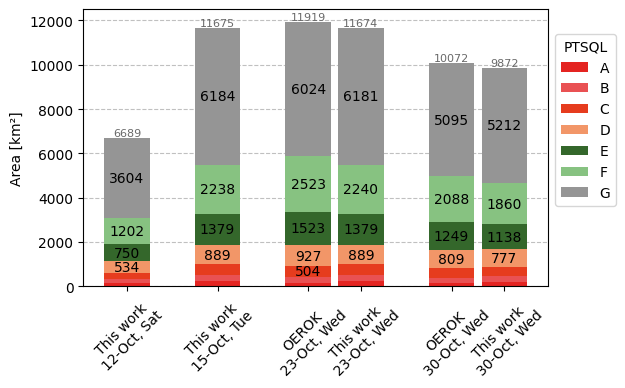
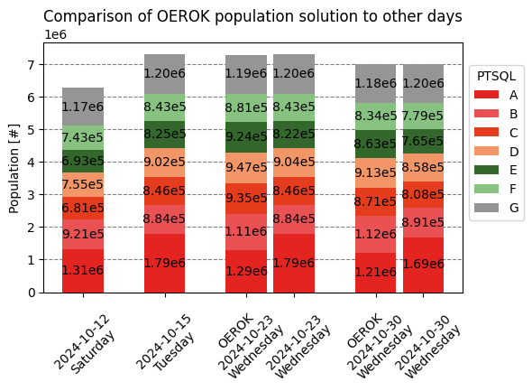

# Analysis of Results

## Weekdays throughout the year

For the analysis of weekdays, one weekday per month was selected, typically around the 15th of the month. However, in January, only the 31st was available due to data constraints. For months where the 15th fell on a weekend or holiday (June, August, September, and December), the closest weekday was used instead.

**Results:**

The area covered by different PTSQLs (Public Transport Service Quality Levels) remained relatively stable throughout the year, with the exception of July and August, where the area covered was significantly smaller. This is likely due to the fact that many maintenance works are typically performed during summer holidays.

The majority of the covered area belonged to the lowest PTSQL, namely G, with approximately 50% of the area covered by this level. The area distribution followed a clear pattern, with increasing PTSQLs resulting in smaller areas. Therefore, the highest PTSQL level (A) covered the smallest area.

In terms of population distribution, the highest PTSQL level is the most populated area, while all other areas showed an approximately even distribution of population. The variance in total population covered by any PTSQL was relatively small, with the exception of potential inaccuracies in the calculation method used.

## Weekends throughout the year

For the analysis of weekends, six days were used (one day every second month, starting in February, alternating between Saturday and Sunday).

**Results:**

Similar to weekdays, the area covered by PTSQLs decreased with increasing PTSQL levels. The distribution of levels within a day was identical to weekdays, except for being approximately halved. A constant difference was observed between Saturdays and Sundays throughout the year, with Sundays having approximately 1000 to 1500 km^2 less area covered than Saturdays.

The total population covered by any PTSQL was approximately 1 million less on weekends than on weekdays. For Sundays, the population was approximately 1.5 million to 1.7 million less than on weekdays. The population distribution was similar for PTSQLs B-F, with levels A and G also showing approximately equal population.

## Existing solution: 23 and 30 October 2024

The existing solution of the OEROK project used the 23rd (schoolday) and 30th (holiday) October 2024.

**Results:**

My results were similar to the existing solution, with some notable differences. The total area covered was almost equal, but slightly larger for the OEROK solution. This was likely due to more accurate calculations of isochrones. The biggest difference was observed in the population covered by the highest PTSQL level, A, with the OEROK solution having approximately 1.3 million people, while my solution had approximately 1.8 million for the schoolday (23rd October) and 1.2 to 1.7 million for the holiday (30th October).

### Population calculation

The population data used in this analysis came from the Eurostat Population Grid Census 2021 (https://ec.europa.eu/eurostat/web/gisco/geodata/population-distribution/population-grids, accessed 2026-03-23). A faster, but less accurate, method was used to calculate the population covered by each PTSQL, based on the centroids of each grid cell. If the centroid was within the area of the PTSQL, the population of that grid cell was added to the total population.

## Conclusion

### Weekdays and weekends

The results showed consistent differences between weekdays and weekends throughout the year. The total area covered was approximately halved on weekends. The summer months (July and August) had significant outliers, with the area covered on weekdays being approximately 2000 km^2 less than in other months. The population covered by higher PTSQL levels A and B was slightly smaller in the summer months.

### OEROK solution

Comparing the OEROK solution with other days during the year showed that on school holidays (30th October), the public transport services were less impacted than on weekends. The numbers for both area and population were between Saturdays and weekdays.

### Final conclusion

The analysis suggests that the OEROK solution is sufficient for weekdays and school holidays, but not for weekends. The data showed bigger differences between weekdays and weekends throughout the year than for weekdays and holidays.